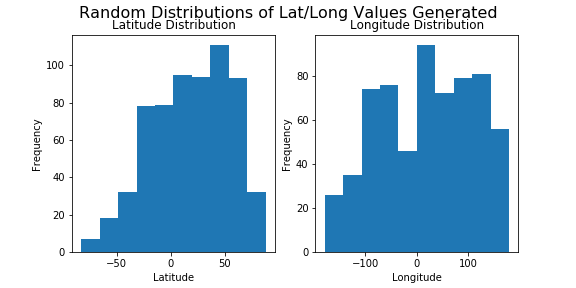
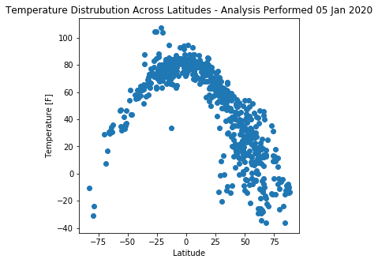
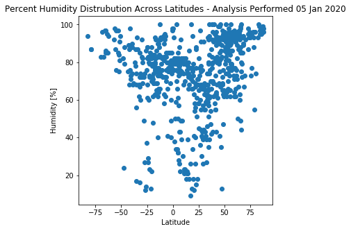
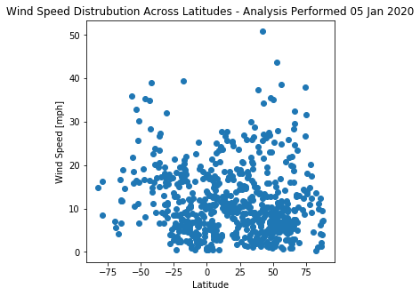
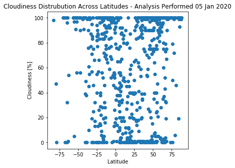

# Weather Trends Over the Globe
## python-api-challenge
Matthew Richtmyer | 05 Jan 2020

## Purpose
* Analyze weather trends across the globe. For example, we know temperature should increase towards the equator, but 
  what other trends exist?
* Use OpenWeather API and citipy to build a dataset from randomly generated latitude and longitude coordinates

## Methodology / Pseuo Code
* Randomly generate two numbers within ranges for lat/long:
    - latitude ranges from +/- 90
    - longitude ranges from +/- 180
* Try citypy to see if it is a city with population >500. 
    * Make api call
        - append lists with temp, humidity, etc. data. also append lists with city/country, lat/long data
        - repeat for 500 cities - probably need a counter bc we don't know how many times the try block will fail
        - iterate counter. Need to check for uniqueness

## Results

  - These distributions look roughly normally distributed. This could be improved in the future by taking a uniform distribution of latitudes/longitudes instead of a normal distribution (which was performed here)

  - Temperature tends to increase towards the equator

  - It appears that all areas can be quite humid, but near the equator are only area that tend to have lower humidities

  - Wind seems largely uniform across all latitudes. 

  - It appears that any area can have all ranges of cloudiness. 
  
